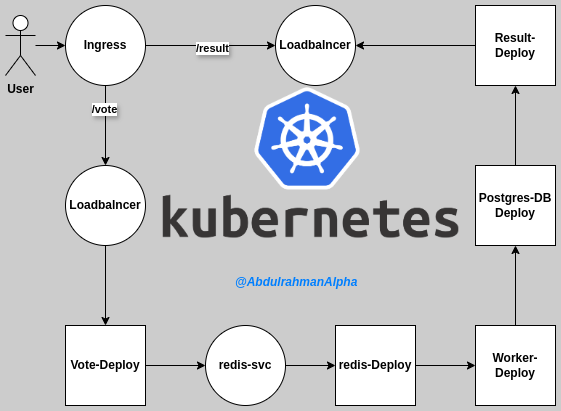

# 🗳️ Kubernetes Voting App: DevOps Demo

A fully containerized **microservices Voting App** deployed on Kubernetes with a clean **ClusterIP → LoadBalancer → Ingress** networking model.  
Perfect for **DevOps & SRE learners** who want to practice real-world Kubernetes deployments.

---

## Features
- Microservices-based voting application:
  - `vote` (Python/Flask frontend)
  - `result` (Node.js/Express frontend)
  - `worker` (background processor)
  - `redis` (queue)
  - `postgres` (database)
- Modern **Kubernetes networking**:
  - Internal `ClusterIP` for service-to-service comms
  - External `LoadBalancer` for exposure
  - `Ingress` with hostname-based routing (`/vote`, `/result`)
- Secrets, ConfigMaps, and Persistent Volumes for stateful services.
- Verified to run on **kind/minikube** locally and supports **cloud-native migration**.

---
# K8S diagram



---

## Project Structure
```

k8s-voting-app/
│── k8s/                    # All Kubernetes manifests
│   ├── vote-deploy.yaml
│   ├── result-deploy.yaml
│   ├── worker-deploy.yaml
│   ├── redis-deploy.yaml
│   ├── postgres-deploy.yaml
│   ├── ingress.yaml
│   └── ...
│── docs/                  # Documentation & guides
│── README.md              # Project overview
│── LICENSE

````

---

## ⚡ Quickstart (Run Locally)

### 1. Clone repo
```bash
git clone https://github.com/<your-username>/k8s-voting-app.git
cd k8s-voting-app
````

### 2. Start a local cluster

```bash
# Using kind
kind create cluster --name voting-cluster
# OR using minikube
minikube start
```

### 3. Deploy app

```bash
kubectl create ns voting
kubectl apply -n voting -f k8s/
```

### 4. Verify pods & services

```bash
kubectl get pods -n voting
kubectl get svc -n voting
```

### 5. Access via Ingress

* Edit `/etc/hosts`:

  ```
  127.0.0.1 voting.local
  ```
* Test:

  ```bash
  curl -H "Host: voting.local" http://localhost:8080/vote
  curl -H "Host: voting.local" http://localhost:8080/result
  ```

---

## 🛠️ Troubleshooting

* Use `kubectl port-forward` to test health:

  ```bash
  kubectl port-forward svc/vote 8081:80 -n voting
  curl http://localhost:8081
  ```
* Check ingress logs:

  ```bash
  kubectl logs -n ingress-nginx deploy/ingress-nginx-controller
  ```

---

## Use Cases

* Learn **K8s networking** (ClusterIP, LoadBalancer, Ingress).
* Practice **DevOps workflows**: GitOps, CI/CD, Helm replacement with pure YAML.
* Build muscle memory for **troubleshooting K8s apps**.

